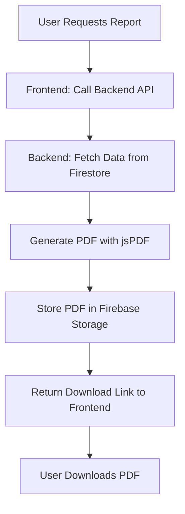

# Hire-Light-ATScore 🚀


[](https://github.com/TanushreeSarkar/HireLightATS/stargazers)
[](https://github.com/TanushreeSarkar/HireLightATS/network)
[](https://github.com/TanushreeSarkar/HireLightATS/issues)
[](https://opensource.org/licenses/MIT)
[](https://nextjs.org/)
[](https://firebase.google.com/)
[](https://vercel.com/)
[](https://github.com/TanushreeSarkar)

## 🌟 Revolutionize Hiring with AI-Powered Precision!

Welcome to **Hire-Light-ATScore** – the ultimate Applicant Tracking System (ATS) that's not just smart, it's *genius*! This web app slices through resumes with surgical precision, parses job descriptions with laser accuracy, and delivers fit scores that make hiring decisions effortless. Powered by cutting-edge AI (via Genkit and Firebase Studio), Hire-Light-ATScore transforms chaotic recruitment into a streamlined, data-driven dream. Whether you're an HR pro, recruiter, or job seeker, this app lights the way to perfect matches! 💡🔥

With interactive dashboards, real-time scoring, customizable profiles, and silky-smooth animations, Hire-Light-ATScore is built for *impact*. It’s wrapped in a modern, responsive design that shines on any device. Ready to make hiring *lit*? Let’s dive in! 🎉

**Live Demo:** [Try Hire-Light-ATScore Now!](https://hire-light-atscore.vercel.app/)  
**Project Status:** Actively Developed | Version 1.0 (August 2025 Release)

## 🎯 Key Features That Blow Your Mind

Hire-Light-ATScore is packed with powerhouse features to supercharge your ATS workflow:

- **🚀 Intelligent Dashboard**: Instant insights with visual charts, progress bars, and recent activity feeds. Track scores at a glance!
- **📤 Seamless File Uploads**: Drag-and-drop resumes (PDF/Text) and job descriptions with animated progress indicators. No more waiting in the dark!
- **🧠 AI-Powered Resume Scoring**: Extracts skills, experience, and achievements. Uses advanced reasoning to score based on your preferences – optional elements? We decide smartly!
- **🔍 Job Description Parsing**: Breaks down JDs into key requirements, skills, and expectations. Reasoning engine filters noise for pure relevance.
- **📊 Resume-JD Fit Scoring**: Compares and conquers! Generates a "Fit Score" with detailed explanations, visualized via donut charts and progress bars.
- **📝 Custom Reports**: Download polished PDF reports with scores, matches, and highlights. Professional, shareable, and ready-to-go!
- **👤 User Profile Magic**: Tailor your experience – set target roles, key skills, and industries. Personalization that adapts to *you*!

| Feature | Why It's Awesome | Tech Behind It |
|---------|------------------|---------------|
| Dashboard | Interactive visuals for quick decisions | Next.js + Recharts |
| Upload | Animated progress & multi-format support | Firebase Storage + React Dropzone |
| Scoring | AI reasoning for accurate fits | Genkit Flows + Firebase AI |
| Reports | One-click PDF exports | jsPDF + Custom Templates |

## 📸 Screenshots & Demos

  
*The Dashboard is your hiring command center, featuring interactive Recharts visualizations (progress bars, donut charts) to display ATS scores, job match percentages, and recent activity. Designed with a clean, grid-based layout, it uses Deep Indigo (#3F51B5) for headers and CTAs, Soft Teal (#4DB6AC) for highlights, and subtle animations for a polished user experience.*

  
*The Upload page offers a seamless drag-and-drop experience for resumes and job descriptions, with animated progress bars to keep you engaged. Built with React Dropzone and styled with Tailwind CSS, it ensures smooth file handling across devices, highlighted by Soft Teal (#4DB6AC) accents and a clean Inter font interface.*

  
*The Fit Scoring page brings hiring to life with vibrant Recharts donut charts and detailed score explanations, powered by Genkit’s AI reasoning. Set against a light gray (#F5F5F5) background with Deep Indigo (#3F51B5) and Soft Teal (#4DB6AC) accents, it offers a clear, responsive view of how resumes match job descriptions, with hover effects for an intuitive experience.*

  
*The Reports page lets you download polished PDF reports with ATS scores, match percentages, and highlights. Designed with a light gray (#F5F5F5) background and Deep Indigo (#3F51B5) buttons, it uses Tailwind CSS for a clean, responsive layout with smooth transitions.*

  
*The History page tracks your ATS journey, displaying a log of uploaded resumes, job descriptions, and scoring activities. With a clean Inter font interface and Deep Indigo (#3F51B5) headers, it uses subtle animations to make reviewing past actions engaging and intuitive.*

  
*The HireHelper feature offers intuitive guidance for users, streamlining the hiring process with AI-driven tips and prompts. Styled with Soft Teal (#4DB6AC) accents and a light gray (#F5F5F5) background, it ensures a seamless, responsive experience across devices.*

  
*The Premium Features page highlights exclusive tools like advanced AI scoring and multi-user collaboration, styled with Soft Teal (#4DB6AC) icons and Deep Indigo (#3F51B5) CTAs. Its grid-based design ensures accessibility across devices, with animations for a premium feel.*

(Pro Tip: Check out our [demo video](https://www.youtube.com/watch?v=example) for live action!)

## 🛠️ Tech Stack – Built for Speed & Scale

- **Frontend**: Next.js 15.3.3 (App Router) + React + Tailwind CSS + ShadCN UI
- **Backend/AI**: Firebase Studio + Genkit (AI Flows for parsing & scoring) – *Hosted as a separate project (see below)*
- **Database/Storage**: Firebase Firestore & Storage
- **Styling**: Inter Font, Deep Indigo (#3F51B5) Primary, Soft Teal (#4DB6AC) Accents
- **Deployment**: Vercel (Frontend) + Firebase Hosting (Backend)
- **Other Goodies**: TypeScript, Custom Hooks, Responsive Design (Mobile-First)

### ⚠️ Backend Deployment Note
The backend (powered by Genkit and Firebase for AI-driven resume and JD parsing) is maintained as a **separate project** due to Vercel’s limitations with complex server-side logic and large dependencies (e.g., `node_modules/@next/swc-*` files exceeding GitHub’s 100 MB limit). This ensures a lightweight, fast frontend deployment on Vercel while the backend runs on Firebase Hosting. To set up the backend, check the [HireLightATS-Backend](https://github.com/TanushreeSarkar/HireLightATS-Backend) repository for instructions. The frontend communicates seamlessly with the backend via API endpoints configured in `.env`.

**Why Separate?** Early attempts to push the full project to GitHub failed due to large files (e.g., `next-swc` binaries over 140 MB). Manual uploads caused branch divergence, and Vercel’s build process couldn’t find the `src/app` directory until the root was set to `src` via `vercel.json`. Splitting the project resolved these issues, enabling smooth deployment and scalability.

## 🏗️ Architecture Design

Hire-Light-ATScore is designed as a modular, scalable system with a clear separation of frontend and backend responsibilities. Below is a detailed breakdown of the architecture, including components, data flow, and interactions.

### System Components
1. **Frontend (Next.js)**:
   - Hosted on Vercel, located in `src/app` with App Router.
   - Handles UI rendering, user interactions, and API calls.
   - Key pages: Dashboard, Upload, Profile, Reports, Auth (Login/Signup), History, HireHelper, Premium Features.
   - Uses Tailwind CSS, ShadCN UI, and Recharts for visualizations.

2. **Backend (Firebase + Genkit)**:
   - Hosted separately on Firebase Hosting ([HireLightATS-Backend](https://github.com/TanushreeSarkar/HireLightATS-Backend)).
   - Manages AI-driven resume/JD parsing, scoring, and report generation.
   - Uses Genkit Flows (`src/ai/flows`) for AI logic and Firebase Functions for serverless endpoints.

3. **Database/Storage (Firebase)**:
   - **Firestore**: Stores user profiles, preferences, parsed data (skills, scores), and activity history.
   - **Storage**: Handles resume/JD uploads (PDF/Text) and PDF reports.

4. **External APIs**:
   - Genkit AI for natural language processing and reasoning.
   - Firebase Authentication for user management.

### Architecture Diagram
Below is an ASCII representation of the system architecture. For a polished visual, use tools like Lucidchart or Draw.io and save to `docs/architecture.png`.

```
+-------------------+       +-------------------+       +-------------------+
|     Frontend      |       |      Backend      |       |     Firebase      |
| (Next.js/Vercel)  |<----->| (Genkit/Firebase) |<----->| (Firestore/Storage)|
+-------------------+       +-------------------+       +-------------------+
| - Dashboard       |       | - API Endpoints   |       | - User Profiles   |
| - Upload Page     |       | - Resume Parsing  |       | - Parsed Data     |
| - Profile Page    |       | - JD Parsing      |       | - File Storage    |
| - Reports Page    |       | - Fit Scoring     |       | - Auth Data       |
| - Auth Pages      |       | - Report Gen      |       | - History Logs    |
| - History Page    |       | - Helper Prompts  |       +-------------------+
| - HireHelper      |       +-------------------+
| - Premium Features|       | Genkit AI (NLP)   |
| - Visualizations  |       +-------------------+
+-------------------+
```

**Flow Explanation**:
- **User Interaction**: Users access the frontend via browser, interacting with pages (e.g., Upload, Dashboard, Reports).
- **File Upload**: Resumes/JDs are uploaded to Firebase Storage, triggering backend API calls.
- **AI Processing**: Backend (Genkit) parses files, extracts data, and scores fits, storing results in Firestore.
- **Data Retrieval**: Frontend fetches parsed data/scores via API for display (e.g., charts, reports, history).
- **Report Generation**: Backend generates PDFs using jsPDF, stored in Firebase Storage for download.
- **Helper & Premium**: HireHelper provides AI-driven prompts; Premium Features include advanced scoring options.

### Flowcharts
Below are flowcharts for key processes, with Mermaid syntax for GitHub rendering. Save visual diagrams in `docs/flowcharts/` using tools like Mermaid or PlantUML.

#### 1. Resume Upload & Scoring Flow
```mermaid
graph TD
    A[User Uploads Resume] --> B[Frontend: Send to Firebase Storage]
    B --> C[Storage: File Saved]
    C --> D[Backend: Trigger Genkit Flow]
    D --> E[Parse Resume (Skills, Exp)]
    E --> F[Store Parsed Data in Firestore]
    F --> G[Calculate Score]
    G --> H[Return Score to Frontend]
    H --> I[Display Score on Dashboard]
```

**Explanation**:
- User uploads a resume (PDF/Text) via the Upload page.
- Frontend sends the file to Firebase Storage using React Dropzone.
- Backend (Genkit Flow in `src/ai/flows/analyze-resume.ts`) parses the resume, extracting skills, experience, and achievements.
- Parsed data is stored in Firestore; a score is calculated based on user preferences.
- Frontend retrieves and displays the score with visualizations (Recharts progress bars).

#### 2. Resume-JD Fit Scoring Flow
```mermaid
graph TD
    A[Upload Resume + JD] --> B[Frontend: Send to Firebase Storage]
    B --> C[Storage: Files Saved]
    C --> D[Backend: Parse Resume + JD]
    D --> E[Extract Skills/Reqs]
    E --> F[Store in Firestore]
    F --> G[Compare Resume vs. JD]
    G --> H[Generate Fit Score + Explanation]
    H --> I[Return to Frontend]
    I --> J[Display on Dashboard (Donut Chart)]
```

**Explanation**:
- User uploads both resume and JD.
- Backend parses both using Genkit, extracting relevant fields (skills, roles, requirements).
- A reasoning engine compares extracted data to generate a Fit Score with explanations.
- Results are stored in Firestore and displayed on the frontend with visualizations.

#### 3. Report Generation Flow


**Explanation**:
- User clicks "Download Report" on the Reports page.
- Frontend calls backend API to fetch scores and parsed data from Firestore.
- Backend generates a PDF using jsPDF, including scores, matches, and highlights.
- PDF is stored in Firebase Storage; a download link is sent to the frontend.

### Why This Architecture?
- **Scalability**: Frontend (Vercel) and backend (Firebase) separation ensures fast, independent scaling.
- **Modularity**: Genkit Flows (`src/ai/flows`) isolate AI logic for easy updates.
- **Reliability**: Firebase Storage/Firestore handle large files and data reliably, bypassing Vercel’s limits.
- **User Experience**: Next.js App Router and Tailwind CSS deliver a responsive, animated UI.

## 🔧 Installation & Setup – Get Running in Minutes!

1. **Clone the Repo**:
   ```bash
   git clone https://github.com/TanushreeSarkar/HireLightATS.git
   cd HireLightATS
   ```

2. **Install Dependencies** (in the `src` directory):
   ```bash
   cd src
   npm install
   ```

3. **Set Up Environment**:
   - Create `.env` in the root:
     ```
     FIREBASE_API_KEY=your_key
     GENKIT_API_KEY=your_key
     BACKEND_API_URL=your_backend_url
     # Add other vars as needed
     ```
   - Get keys from Firebase Console and backend setup.

4. **Run Locally**:
   ```bash
   npm run dev
   ```
   Open [http://localhost:3000](http://localhost:3000) – Boom! 🚀

5. **Build & Deploy**:
   ```bash
   npm run build
   ```
   - Deploy frontend to Vercel (ensure `vercel.json` sets `src` as root).
   - Deploy backend to Firebase Hosting (see [HireLightATS-Backend](https://github.com/TanushreeSarkar/HireLightATS-Backend)).

6. **Vercel Configuration**:
   - Set the root directory to `src` in Vercel’s dashboard (**Settings > General**) or use `vercel.json`:
     ```json
     {
       "builds": [
         {
           "src": "src/package.json",
           "use": "@vercel/next"
         }
       ],
       "routes": [
         {
           "src": "/(.*)",
           "dest": "src/$1"
         }
       ],
       "functions": {
         "src/app/**/*.tsx": {
           "maxDuration": 120
         }
       }
     }
     ```

(For detailed setup, see [docs/setup.md](docs/setup.md))

## 📈 Usage Guide – Hire Smarter Today!

1. **Sign Up/Login**: Hit the auth pages to get started.
2. **Upload Files**: Drop resumes & JDs on the Upload page.
3. **Score & Analyze**: Watch the AI magic on Dashboard/Reports.
4. **Customize Profile**: Tweak prefs for personalized scoring.
5. **Export Reports**: Download PDFs with one click!

Pro Tip: Use the sidebar for quick navigation – it’s responsive and icon-packed! 📱

## 🤝 Contributing – Join the Revolution!

We love contributions! Fork, branch, PR – let's build together:
- **Issues**: Report bugs or suggest features [here](https://github.com/TanushreeSarkar/HireLightATS/issues).
- **Pull Requests**: Follow our [CONTRIBUTING.md](CONTRIBUTING.md).
- **Code Style**: ESLint + Prettier enforced.

Shoutout to contributors: @yourname (coming soon!) 🌟

## 📜 License

MIT License – Free to use, modify, and distribute. See [LICENSE](LICENSE) for details.

## 👋 Connect & Stay Updated

- **Author**: Tanushree Sarkar ([GitHub](https://github.com/TanushreeSarkar) | [LinkedIn](https://linkedin.com/in/tanushree-sarkar))
- **Community**: Join our [Discord](https://discord.gg/example) for discussions!
- **Roadmap**: AI enhancements, multi-user support, integrations (e.g., LinkedIn API) – star & watch for updates! ⭐

**Star this repo if Hire-Light-ATScore lights up your hiring game!** 💥 Questions? Open an issue or DM me. Let's make recruitment epic! 🎊
